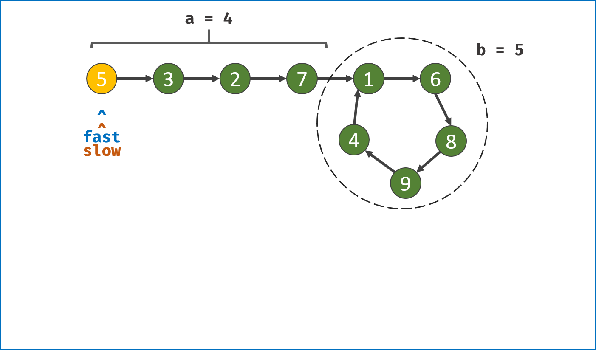

# 环形链表问题

环形链表是一类问题，通常可以使用快慢指针来很好的解决这类问题。

环形链表问题有两个变种：

- 判断链表中是否有环
- 找出链表的入环点

## 1. 链表中是否有环

LeetCode 141 Linked List Cycle <https://leetcode-cn.com/problems/linked-list-cycle/>

### 1.1. 哈希集合解法

最容易想到的方法就是遍历所有节点，每次遍历到一个节点时，判断该节点是否被访问过。

具体的，我们可以使用哈希集合来存储所有已经被访问过的节点。每次我们达到一个节点时，如果该节点已经存在于哈希集合中，则说明该链表是环形链表，否则就将该节点存入哈希集合中。重复这一过程，直到我们遍历完整个链表即可。

```python
class Solution:
    def hasCycle(self, head: ListNode) -> bool:
        seen = set()
        while head:
            if head in seen:
                return True
            seen.add(head)
            head = head.next
        return False
```

Complexity Analysis

- time complexity：$O(N)$，其中 N 是链表中的节点数。最坏情况下我们需要遍历每个节点一次。
- space complexity：$O(N)$，其中 N 是链表中的节点数。主要为哈希表的开销，最坏情况下我们需要将每个节点插入到哈希表中一次。

### 1.2. 快慢指针解法

本方法需要读者对「Floyd 判圈算法」（又称龟兔赛跑算法）有所了解。

假想「乌龟」和「兔子」在链表上移动，「兔子」跑得快，「乌龟」跑得慢。当「乌龟」和「兔子」从链表上的同一个节点开始移动时，如果该链表中没有环，那么「兔子」将一直处于「乌龟」的前方；如果该链表中有环，那么「兔子」会先于「乌龟」进入环，并且一直在环内移动。等到「乌龟」进入环时，由于「兔子」的速度快，它一定会在某个时刻与乌龟相遇，即套了「乌龟」若干圈。

我们可以根据上述思路来解决本题。具体地，我们定义两个指针，一快一慢。慢指针每次只移动一步，而快指针每次移动两步。初始时，慢指针在位置 head，而快指针在位置 head.next。这样一来，如果在移动的过程中，快指针反过来追上慢指针，就说明该链表为环形链表。否则快指针将到达链表尾部，该链表不为环形链表。

为什么我们要规定初始时慢指针在位置 head，快指针在位置 head.next，而不是两个指针都在位置 head（即与「乌龟」和「兔子」中的叙述相同）？

观察下面的代码，我们使用的是 while 循环，循环条件先于循环体。由于循环条件一定是判断快慢指针是否重合，如果我们将两个指针初始都置于 head，那么 while 循环就不会执行。因此，我们可以假想一个在 head 之前的虚拟节点，慢指针从虚拟节点移动一步到达 head，快指针从虚拟节点移动两步到达 head.next，这样我们就可以使用 while 循环了。

当然，我们也可以使用 do-while 循环。此时，我们就可以把快慢指针的初始值都置为 head。

```python
class Solution:
    def hasCycle(self, head: ListNode) -> bool:
        if not head or not head.next:
            return False

        slow = head
        fast = head.next

        while slow != fast:
            if not fast or not fast.next:
                return False
            slow = slow.next
            fast = fast.next.next

        return True
```

Complexity Analysis

- time complexity：$O(N)$，其中 N 是链表中的节点数。
- space complexity：$O(1)$，我们只使用了两个指针的额外空间。

## 2. 找出链表入环点

LeetCode 142 Linked List Cycle II <https://leetcode-cn.com/problems/linked-list-cycle-ii/>

### 2.1. 哈希集合解法

一个非常直观的思路是：我们遍历链表中的每个节点，并将它记录下来；一旦遇到了此前遍历过的节点，就可以判定链表中存在环。借助哈希表可以很方便地实现。

```python
def detect_cycle_1(head: ListNode) -> ListNode:
    if head is None:
        return None
    visited = set()
    node = head
    while node is not None:
        if node in visited:
            return node
        else:
            node = node.next

    return None
```

Complexity Analysis

- time complexity：$O(N)$，其中 N 是链表中的节点数。最坏情况下我们需要遍历每个节点一次。
- space complexity：$O(N)$，其中 N 是链表中的节点数。主要为哈希表的开销，最坏情况下我们需要将每个节点插入到哈希表中一次。

### 2.2. 快慢指针解法

From: <https://leetcode-cn.com/problems/linked-list-cycle-ii/solution/linked-list-cycle-ii-kuai-man-zhi-zhen-shuang-zhi-/>

我们使用两个指针，fast 与 slow。它们起始都位于链表的头部。随后，slow 指针每次向后移动一个位置，而 fast 指针向后移动两个位置。如果链表中存在环，则 fast 指针最终将再次与 slow 指针在环中相遇。



1. 双指针第一次相遇： 设两指针 fast，slow 指向链表头部 head，fast 每轮走 2 步，slow 每轮走 1 步；
    1. 第一种结果： fast 指针走过链表末端，说明链表无环，直接返回 null；
    2. 第二种结果： 当fast == slow时， 两指针在环中第一次相遇 。下面分析此时fast 与 slow走过的 步数关系 ：

    设链表共有 a+b 个节点，其中链表头部到链表入口有 a 个节点（不计链表入口节点）， 链表环 有 b 个节点（这里需要注意，a 和 b 是未知数，例如图解上链表 a=4，b=5）；设两指针分别走了 f，s 步，则有：fast 走的步数是 slow 步数的 2 倍，即 $f = 2s$，这是因为 fast 每轮走 2 步；
    fast 比 slow 多走了 n 个环的长度，即 $f = s + nb$；（ 解析： 双指针都走过 a 步，然后在环内绕圈直到重合，重合时 fast 比 slow 多走 环的长度整数倍 ）；以上两式相减得：$f = 2nb, s = nb$，即 fast 和 slow  指针分别走了 2n，n 个 环的周长，推导出这一步非常重要。

2. 目前情况分析
   1. 如果让指针从链表头部一直向前走并统计步数k，那么所有走到链表入口节点时的步数 是：$k=a+nb$（先走 a 步到入口节点，之后每绕 1 圈环（ b 步）都会再次到入口节点）。
   2. 而目前，slow 指针走过的步数为 $nb$ 步。因此，我们只要想办法让 slow 再走 a 步停下来，就可以到环的入口。
   3. 但是我们不知道 a 的值，该怎么办？依然是使用双指针法。我们构建一个指针，此指针需要有以下性质：此指针和 slow 一起向前走 a 步后，两者在入口节点重合。那么从哪里走到入口节点需要 a 步？答案是链表头部 head。
3. 双指针第二次相遇
   1. slow 指针 **位置不变** ，将 fast 指针重新 **指向链表头部节点** ；slow 和 fast 同时每轮向前走 1 步；
   2. 当 fast 指针走到 $f = a$ 步时，slow 指针走到步 $s = a+nb$，此时 **两指针重合，并同时指向链表环入口** 。
4. **返回 slow 指针指向的节点。**

上面分析的关键点：

1. 走 $a + nb$ 步一定是在环入口
2. 第一次相遇时慢指针已经走了 $nb$ 步

代码

```python
class Solution:
    def detectCycle(self, head):
        fast, slow = head, head
        while True:
            if not (fast and fast.next): return
            fast, slow = fast.next.next, slow.next
            if fast == slow: break
        fast = head
        while fast != slow:
            fast, slow = fast.next, slow.next
        return fast
```

Complexity Analysis

- time complexity：$O(N)$，其中 N 是链表中的节点数。
- space complexity：$O(1)$

