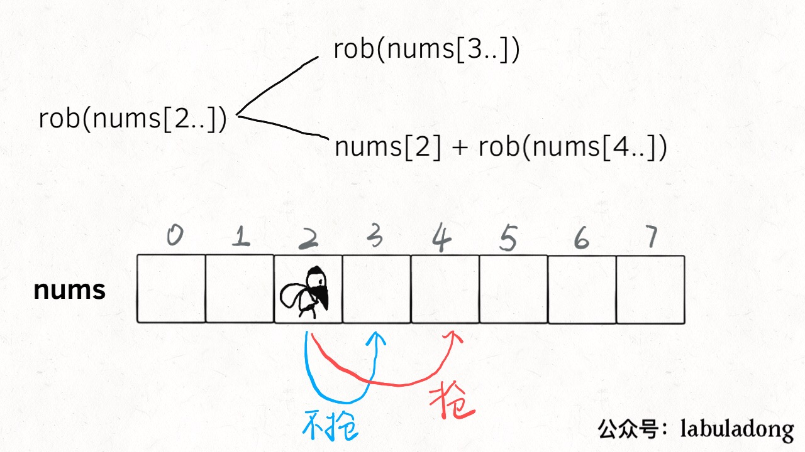
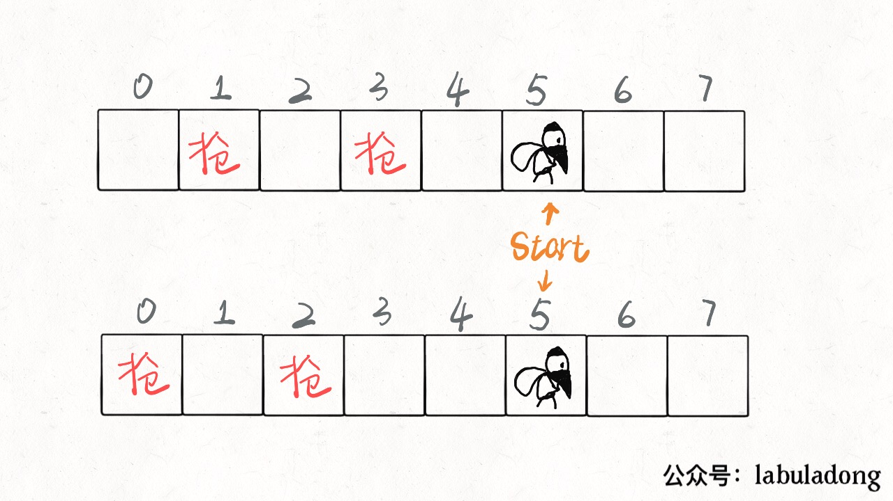
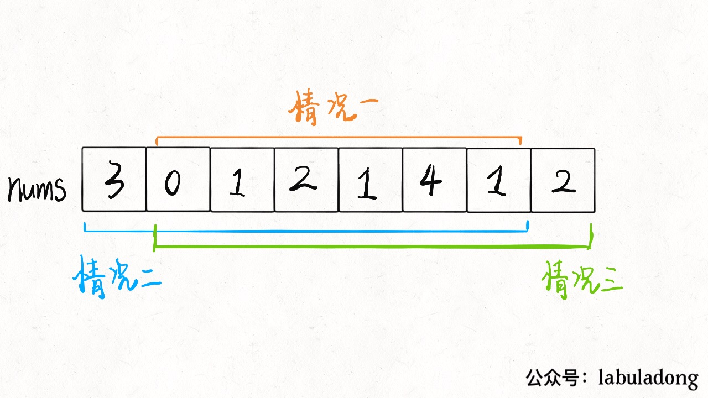

# 打家劫舍系列问题

打家劫舍系列总共有三道，难度设计非常合理，层层递进。第一道是比较标准的动态规划问题，而第二道融入了环形数组的条件，第三道更绝，把动态规划的自底向上和自顶向下解法和二叉树结合起来，我认为很有启发性。如果没做过的朋友，建议学习一下。

下面，我们从第一道开始分析。

## 198. House Robber I

From: <https://leetcode-cn.com/problems/house-robber/> or <https://leetcode.com/problems/house-robber/>

题目很容易理解，而且动态规划的特征很明显。我们前文「动态规划详解」做过总结，**解决动态规划问题就是找「状态」和「选择」，仅此而已**。

假想你就是这个专业强盗，从左到右走过这一排房子，在每间房子前都有两种选择：抢或者不抢。

如果你抢了这间房子，那么你肯定不能抢相邻的下一间房子了，只能从下下间房子开始做选择。

如果你不抢这件房子，那么你可以走到下一间房子前，继续做选择。

以上的逻辑很简单吧，其实已经明确了「状态」和「选择」：**你面前房子的索引就是状态，抢和不抢就是选择**。



在两个选择中，每次都选更大的结果，最后得到的就是最多能抢到的 money：

```java
public class HouseRobber {

    public int rob(int[] nums) {
        return dp(nums, 0);
    }

    /**
     * 返回 dp[start..] 能抢到的最大值
     */
    public int dp(int[] nums, int start) {
        if (start >= nums.length) {
            return 0;
        }

        int res = Math.max(
                dp(nums, start + 1),               // 不抢当前的，去下家
                dp(nums, start + 2) + nums[start]  // 抢当前的，去下下家
        );

        return res;
    }

}
```

明确了状态转移，就可以发现对于同一 `start` 位置，是存在重叠子问题的，比如下图：



盗贼有多种选择可以走到这个位置，如果每次到这都进入递归，岂不是浪费时间？所以说存在重叠子问题，可以用备忘录进行优化：

```java
public class HouseRobber {

    private int[] memo;

    public int rob(int[] nums) {
        // 初始化备忘录
        memo = new int[nums.length];
        Arrays.fill(memo, -1);
        return dp(nums, 0);
    }

    /**
     * 返回 dp[start..] 能抢到的最大值
     */
    public int dp(int[] nums, int start) {
        if (start >= nums.length) {
            return 0;
        }

        // 避免重复计算
        if (memo[start] != -1) {
            return memo[start];
        }

        int res = Math.max(
                dp(nums, start + 1),               // 不抢当前的，去下家
                dp(nums, start + 2) + nums[start]  // 抢当前的，去下下家
        );

        // 记入备忘录
        memo[start] = res;
        return res;
    }
}
```

这就是自顶向下的动态规划解法，我们也可以略作修改，写出**自底向上**的解法。记：

$f(k)$ 为从前 k 个房屋中能抢劫到的最大数额，$A_i$ = 第 i 个房屋的钱数。

首先看 $n=1$ 的情况，显然 $f(1)=A_1$。

再看 $n=2$，$f(2)=max(A_1, A_2)$。

对于 $n=3$，有两个选项：

- 抢第三个房子，将数额与第一个房子相加。
- 不抢第三个房子，保持现有最大数额。

显然，你想选择数额更大的选项。于是，可以总结出公式（状态转移方程）：
$$
f(k) = max(f(k – 2) + A_k,f(k – 1))
$$
我们选择 $f(–1) = f(0) = 0$ 为初始情况，这将极大地简化代码。答案为 $f(n)$。我们又发现状态转移只和 `f(k)` 最近的两个状态有关，我们用两个变量来保存最近的两个状态，所以可以进一步优化，将空间复杂度降低到 O(1)。

```java
public class HouseRobber {

    public int rob(int[] nums) {
        int prevMax = 0, curMax = 0;
        for (int num : nums) {
            int temp = curMax;
            curMax = Math.max(curMax, prevMax + num);
            prevMax = temp;
        }

        return curMax;
    }
}
```

## 213. House Robber II

From: <https://leetcode.com/problems/house-robber-ii/> or <https://leetcode-cn.com/problems/house-robber-ii/>

这道题目和第一道描述基本一样，强盗依然不能抢劫相邻的房子，输入依然是一个数组，但是告诉你**这些房子不是一排，而是围成了一个圈**。

首先，首尾房间不能同时被抢，那么只可能有三种不同情况：要么都不被抢；要么第一间房子被抢最后一间不抢；要么最后一间房子被抢第一间不抢。



那就简单了啊，这三种情况，那种的结果最大，就是最终答案啊！不过，其实我们不需要比较三种情况，只要比较情况二和情况三就行了，因为这两种情况对于房子的选择余地比情况一大呀，房子里的钱数都是非负数，所以选择余地大，最优决策结果肯定不会小。

所以只需对之前的解法稍作修改，做两次动态规划即可：

```java
public class HouseRobber {

    public int rob(int[] nums) {
        int n = nums.length;
        if (n == 1) {
            return nums[0];
        }
        return Math.max(robRange(nums, 0, n - 2), robRange(nums, 1, n - 1));
    }

    /**
     * 仅计算闭区间 [start,end] 的最优结果
     *
     * @param lo inclusive
     * @param hi inclusive
     */
    public int robRange(int[] nums, int lo, int hi) {
        int prevMax = 0, curMax = 0;
        for (int i = lo; i <= hi; i++) {
            int temp = curMax;
            curMax = Math.max(curMax, prevMax + nums[i]);
            prevMax = temp;
        }

        return curMax;
    }
}
```

至此，第二问也解决了。

## 337. House Robber III

From: <https://leetcode.com/problems/house-robber-iii/> or <https://leetcode-cn.com/problems/house-robber-iii/>

第三题又想法设法地变花样了，此强盗发现现在面对的房子不是一排，不是一圈，而是一棵二叉树！房子在二叉树的节点上，相连的两个房子不能同时被抢劫，果然是传说中的高智商犯罪。

整体的思路完全没变，还是做抢或者不抢的选择，去收益较大的选择。

我们使用父亲、两个孩子、4 个孙子来说明问题：
首先来定义这个问题的状态
父节点获取到最大的偷取的钱数呢

首先要明确相邻的节点不能偷，也就是父节点选择偷，两个儿子节点就不能偷了，但是四个孙子节点可以偷。
根据以上条件，我们可以得出当前节点的钱该怎么算
从四个孙子节点开始下手偷的钱 + 父节点的钱 VS 从两个儿子节点开始下手偷的钱，哪个组合钱多，就当做当前节点能偷的最大钱数。这就是动态规划里面的最优子结构

由于是二叉树，这里可以选择计算所有子节点。

```java
public class HouseRobber {

    private static class TreeNode {
        public int val;
        public TreeNode left;
        public TreeNode right;

        public TreeNode(int val) {
            this.val = val;
        }
    }

    public int rob(TreeNode root) {
        if (root == null) {
            return 0;
        }

        int money = root.val;
        if (root.left != null) {
            // 从左孩子的两个孙子下手
            money += rob(root.left.left) + rob(root.left.right);
        }
        if (root.right != null) {
            // 从右孩子的两个孙子下手
            money += rob(root.right.left) + rob(root.right.right);
        }

        // 比较两种组合，返回较大值
        return Math.max(money, rob(root.left) + rob(root.right));
    }
}
```

经过分析上面的代码，我们发现计算当前节点最多能偷多少钱的时候，同时计算了 4 个孙子节点能偷多少钱，也计算了 2 个儿子节点能偷多少钱。这样在儿子当父节点时，就会产生重复计算一遍孙子节点。

于是乎我们发现了一个动态规划的关键优化点，而解决方案仍然是备忘录：

```java
public class HouseRobber {

    private HashMap<TreeNode, Integer> memo = new HashMap<>();

    private static class TreeNode {
        public int val;
        public TreeNode left;
        public TreeNode right;

        public TreeNode(int val) {
            this.val = val;
        }
    }

    public int rob(TreeNode root) {
        if (root == null) {
            return 0;
        }

        if (memo.containsKey(root)) {
            return memo.get(root);
        }

        int money = root.val;
        if (root.left != null) {
            // 从左孩子的两个孙子下手
            money += rob(root.left.left) + rob(root.left.right);
        }
        if (root.right != null) {
            // 从右孩子的两个孙子下手
            money += rob(root.right.left) + rob(root.right.right);
        }

        // 比较两种组合，返回较大值
        int res = Math.max(money, rob(root.left) + rob(root.right));
        memo.put(root, res);
        return res;
    }
}
```

上面两种解法用到了孙子节点，计算父节点能偷的钱还要同时去计算孙子节点投的钱，虽然用了备忘录，但是还是有性能损耗。

我们换一种办法来定义此问题

每个节点可选择偷或者不偷两种状态，根据题目意思，相连节点不能一起偷：

- 当前节点选择偷时，那么两个孩子节点就不能选择偷了

- 当前节点选择不偷时，两个孩子节点只需要拿最多的钱出来就行（两个孩子节点偷不偷没关系）

我们使用一个大小为 2 的数组来表示 `int[] res = new int[2]`，第一个元素表示代表不偷当前节点所能得到的最多的钱，第二个元素代表偷当前节点所能得到的最多的钱。

任何一个节点能偷到的最大钱的状态可以定义为：

```java
res[0] = Math.max(rob(root.left)[0], rob(root.left)[1]) + Math.max(rob(root.right)[0], rob(root.right)[1])
res[1] = rob(root.left)[0] + rob(root.right)[0] + root.val;
```

将公式做个变换就是代码啦

```java
public class HouseRobber {

    private static class TreeNode {
        public int val;
        public TreeNode left;
        public TreeNode right;

        public TreeNode(int val) {
            this.val = val;
        }
    }

    public int rob(TreeNode root) {
        int[] result = robInternal(root);
        return Math.max(result[0], result[1]);
    }

    public int[] robInternal(TreeNode cur) {
        if (cur == null) {
            return new int[]{0, 0};
        }

        int[] result = new int[2];

        // 选择偷当前节点，则两个孩子节点不能偷
        int[] left = robInternal(cur.left);
        int[] right = robInternal(cur.right);
      
      	// 选择偷当前节点，则两个孩子节点不能偷
        result[1] = left[0] + right[0] + cur.val;
        // 选择不偷当前节点，则考虑两个孩子节点的情况（孩子节点可偷可不偷）,取左右两个孩子所能得到能得到的最大值之和
        result[0] = Math.max(left[0], left[1]) + Math.max(right[0], right[1]);
      
        return result;
    }
}
```

